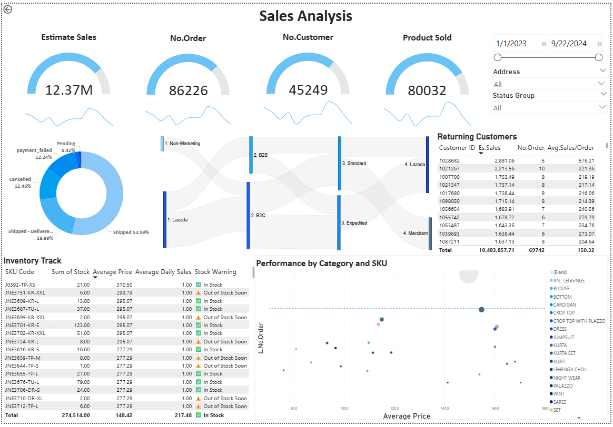
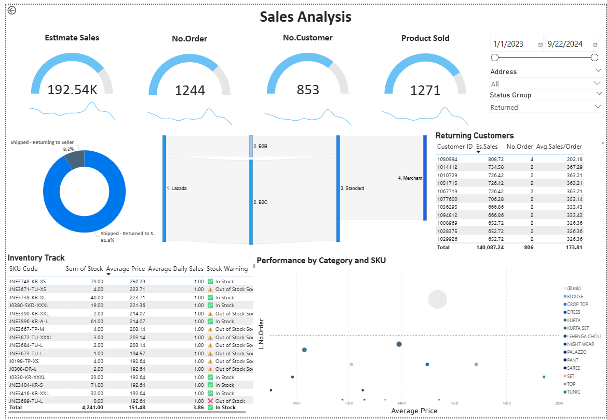

# Sales Analysis-Dashboard-Ecommerce

##  Project Overview

This project analyzes e-commerce sales performance using Power BI to create an interactive dashboard that provides actionable business insights. The dashboard focuses on order analysis, customer behavior, and operational efficiency to support data-driven decision making.

## Key Business Questions

- **Sales Performance**: Where do the most sales come from by region, channel, and product?
- **Customer Retention**: Who are the returning customers and what's their value?
- **Operational Issues**: Why do deliveries fail and how to reduce losses?

## Dashboard Components

- **KPI Overview**: Total sales (12.37M), orders (86,226), customers (45,249), products sold (80,032)
- **Order Status Analysis**: Visual breakdown of shipped, cancelled, and failed orders
- **Customer Segmentation**: Returning customers analysis with purchase frequency
- **Inventory Management**: Stock tracking with warnings for low inventory
- **Performance Analytics**: Sales performance by category and SKU

## Key Business Insights

### 1. **Strong Delivery Success Rate (72.58%)**
- Over half of all orders are successfully shipped and delivered
=> Confirms reliable fulfillment operations, building customer trust and repeat business

### 2. **Significant Customer Retention Opportunity**
- Returning customers show Sales form returned customers nearly 80% of Es.Sales
-> Focus retention programs on high-value repeat customers can significantly boost revenue

### 3. **Critical Inventory & Failure Management**
- 12.44% cancellation rate and 12.22% payment failures indicate process improvement opportunities
- Real-time inventory tracking prevents stockouts for high-performing SKUs
-> Reducing failed orders by even 5% could recover substantial lost revenue and improve customer satisfaction

### 4. **Returned Rate**

-> Addressing root causes of returns (product quality, description accuracy, merchant service) could recover significant lost revenue and improve customer satisfaction scores

## Tools Used

- **Power BI**: Dashboard development and visualization
- **DAX**: Custom calculations and KPI measures
- **Power Query**: Data transformation and modeling

## Business Value

This dashboard enables stakeholders to:
- Monitor real-time sales performance and identify trends
- Optimize inventory management to prevent stockouts
- Reduce order failures through targeted process improvements
- Develop data-driven customer retention strategies
